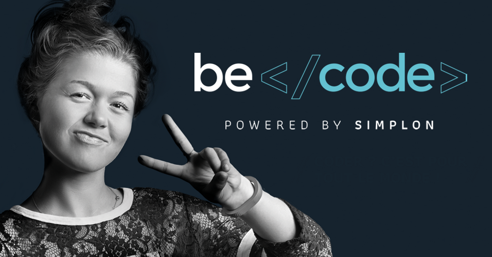

# BeCode "Introduction to JavaScript" Workshop

## How to BeCode :octocat:



At BeCode we help motivated people become **junior web developers**.  
This means that during the **7 months** at BeCode we help you navigate the ever-growing world of web development.

Being a web developer means **never stop learning**. There are a lot of brand new technologies out there, and every day new solutions for new problems are found.  
This is why at BeCode we don't teach, instead, we help you find out how you can **teach yourself**.

At BeCode we use an **active learning** pedagogy, that boils down to 3 simple rules:

- When in doubt, Google it
- When you don't find it on Google, ask your teammates
- And in the end, of that doesn't work: ask your coach

This means that learning with us is not like listening to a teacher all the time as in a traditional school: instead, it is more like going on an exploration adventure yourself!

## Let's code

Today I will introduce you to **JavaScript**, a core programming language present in most webpages you visit. After the short introduction, it's up to you to push yourself to discover more. Today we will be making a calculator together!

At the beginning, I will give a short introduction to this new technology. As we progress further in the training there will be less information from me, and it will be up to you to find solutions yourself.

## JavaScript


So what is JavaScript exactly? If we take a look at the [documentation](https://developer.mozilla.org/en-US/docs/Web/JavaScript/About_JavaScript) on MDN, we find the following explanation:

> JavaScript® (often shortened to JS) is a lightweight, interpreted, object-oriented language with first-class functions, and is best known as the scripting language for Web pages, but it's used in many non-browser environments as well.

Confused? That's ok. For the moment all that matters to us is that it's a **programming language** and that it can be used to add functionality to web pages.

By the way, do not confuse _JavaScript_ with the _Java_ programming language. The two programming languages have very different syntax, semantic, and use.

### Try it yourself

Use the documentation on MDN to find solutions for the following questions:

<details><summary>How do I declare a variable?</summary>

```js
// There are three different ways, but today we will use one:
let age = 10;
```

</details>

<details><summary>How do I run a piece of code only when certain conditions are verified?</summary>

```js
let age = 10;
if (age >= 18) {
  alert("Yay, I can drive!");
} else {
  alert("Awwww, I need to wait some time...");
}
```

</details>

<details><summary>How do I tell JavaScript that I want to work with a certain HTML element in the page (how do I select an element)?</summary>

If I have something like:

```html
<p>
  Lorem ipsum dolor sit amet, consectetur adipiscing elit, sed do eiusmod tempor
  incididunt ut labore et dolore magna aliqua. [...] Excepteur sint occaecat
  cupidatat non proident, sunt in culpa qui officia deserunt mollit anim id est
  laborum.
</p>
<button id="myButton">Lorem ipsum</button>
```

...I can select the button with:

```js
let myButton = document.getElementById("button");
```

</details>

### Some useful resources

- [Learn JavaScript on MDN](https://developer.mozilla.org/en-US/docs/Learn/JavaScript)
- [Basic concepts of JavaScript](https://react.design/javascript)
- [freecodecamp course](https://www.freecodecamp.org/learn/javascript-algorithms-and-data-structures/basic-javascript/)
- [Just google it!](https://google.com)

### Challenge

**Let's build a calculator!**

For your convenience, I have prepared a starting set up.

1. Open the page https://codepen.io/mjsarfatti/pen/VwjVeoz?editors=1010
2. Click on `Fork`, it's a small tiny button on the bottom right of the page
3. If you don't have an account yet, sign up to Codepen (it's free, and it's an awesome place to experiment with HTML, CSS and JS!)

Your task: the HTML and CSS are ready, all you have to do is to write the necessary JavaScript so that when you click on `Submit` a result is shown next to the word `Result:`.

Don't know where to start? Try to follow these steps:

1. Select the button element (we solved this problem earlier on)
2. Attach (add) a "click" event handler to the button element (Google this one 😉)
3. Inside the event handler function, for each input element (_first number_, _operation_, and _second number_), select it, and then select its _value_ (Google this one as well)
4. Use a conditional (`if/else`) on the value of the operation and add, subtract, multiply or divide the two numbers (put the result in another variable)
5. Now select the "result" element, and print the result inside (Google how to modify the text content of an element)
6. Voilà! Your calculator is made 🙌
